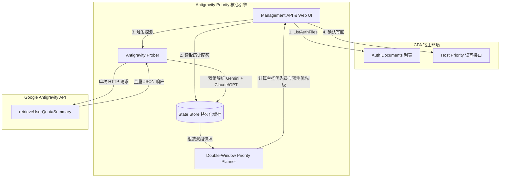

# Antigravity Priority v1.1.0 需求与技术规格路线图 (Roadmap & Technical Spec)

**版本目标**：v1.1.0  
**状态**：已确立 / 待实施 (Confirmed / Ready for Implementation)  
**创建日期**：2026-08-18  
**前置版本**：v1.0.1 (已发布)

---

## 目录
1. [需求总览 (Requirements Summary)](#1-需求总览-requirements-summary)
2. [确立需求详细设计 (Detailed Specifications)](#2-确立需求详细设计-detailed-specifications)
   - [2.1 REQ-01：下次运行倒计时自适应格式与实时更新](#21-req-01下次运行倒计时自适应格式与实时更新)
   - [2.2 REQ-02：配置参数容错解析与默认值平滑兜底及诊断告警呈现](#22-req-02配置参数容错解析与默认值平滑兜底及诊断告警呈现)
   - [2.3 REQ-03：原生风格自定义 Confirm 确认弹窗](#23-req-03原生风格自定义-confirm-确认弹窗)
   - [2.4 REQ-04：凭证列表常驻展示、配额按需探测与两阶段 Dry-Run](#24-req-04凭证列表常驻展示配额按需探测与两阶段-dry-run)
   - [2.5 REQ-05：单请求双模型组解析与预测优先级即时切换](#25-req-05单请求双模型组解析与预测优先级即时切换)
   - [2.6 REQ-06：UI 布局优化、独立滚动容器、紧凑双列卡片与平滑动效](#26-req-06ui-布局优化独立滚动容器紧凑双列卡片与平滑动效)
   - [2.7 REQ-07：执行历史变更明细对比弹窗 (Apply 变更 & Dry-Run 预测对比)](#27-req-07执行历史变更明细对比弹窗-apply-变更--dry-run-预测对比)
   - [2.8 REQ-08：自动调度时间区间限制、一键手动暂停/恢复与面板级持久化控制](#28-req-08自动调度时间区间限制一键手动暂停恢复与面板级持久化控制)
3. [系统架构与领域模型 (Architecture & Domain Model)](#3-系统架构与领域模型-architecture--domain-model)
4. [前端交互状态机与 UI 规范 (Frontend UX & State Machine)](#4-前端交互状态机与-ui-规范-frontend-ux--state-machine)
5. [后端接口与数据结构演进 (Backend API & Data Schema)](#5-后端接口与数据结构演进-backend-api--data-schema)
6. [测试策略与验证矩阵 (Testing Strategy)](#6-测试策略与验证矩阵-testing-strategy)

---

## 1. 需求总览 (Requirements Summary)

| 编号 | 需求项 | 模块 | 优先级 | 核心价值 |
| :--- | :--- | :--- | :--- | :--- |
| **REQ-01** | 下次自动调度倒计时实时刷新与自适应时间格式 | 前端 / 后端 | P1 | 消除静态字符串显示，提供秒级自适应倒计时体验 |
| **REQ-02** | 插件配置参数大小写容错与全字段健壮兜底 | 配置解析 | P0 | 杜绝配置误填（如 `30M`）导致插件启动崩溃或停止服务 |
| **REQ-03** | 自定义模态 Confirm 对话框替换浏览器原生 Confirm | 前端 UI | P1 | 适配 CPA Host 双主题与设计系统，提升整体视觉质感 |
| **REQ-04** | 凭证列表常驻展示、配额缓存按需探测与两阶段 Dry-Run | 调度与交互 | P0 | 规避频繁探测 Google 配额接口导致的风控与 429 限制 |
| **REQ-05** | 单 HTTP 请求提取全组配额与跨模型组预测优先级即时切换 | 核心引擎 | P0 | 一次请求同时获取 Gemini 与 Claude/GPT 额度，支持即时切换预测视图 |
| **REQ-06** | UI 布局优化、独立滚动容器、紧凑双列卡片与平滑动效 | 前端 UI/动效 | P1 | 消除页面整体滚动，支持单行/双列视图切换，提供复制与细腻动效 |
| **REQ-07** | 执行历史变更明细对比弹窗 (Apply 变更 & Dry-Run 预测对比) | 诊断与历史 | P1 | 支持回溯历史调度详情，清晰对比 Apply 实际写回与 Dry-Run 前后配额差异 |
| **REQ-08** | 自动调度时间区间限制、一键手动暂停/恢复与面板级持久化控制 | 调度核心 / UI | P0 | 支持在 UI 直接一键启停调度与配置生效时段（如夜间/工作时间），免改 YAML 重启 |

---

## 2. 确立需求详细设计 (Detailed Specifications)

### 2.1 REQ-01：下次运行倒计时自适应格式与实时更新

#### 现状与痛点
当前后端 `Diagnostics` 接口返回 `next_wait` 为 Go `time.Duration.String()`（如 `18m37.989992568s`），前端直接渲染该静态字符串，既不美观也不具备实时倒计时能力。

#### 技术设计
1. **接口扩展**：
   - 后端在 `Diagnostics.scheduler` 中补充 `next_run_at`（RFC3339 格式绝对时间戳，如 `2026-08-18T10:18:37Z`）。
2. **自适应格式算法 (`formatSchedulerCountdown`)**：
   - 当剩余时间 $> 24\text{h}$：显示 `Xd XXh XXm`（如 `2d 04h 15m`）。
   - 当 $1\text{h} \le \text{剩余时间} \le 24\text{h}$：显示 `XXh XXm XXs`（如 `02h 15m 30s`）。
   - 当 $1\text{m} \le \text{剩余时间} < 1\text{h}$：**自动省略 `h`**，显示 `XXm XXs`（如 `18m 38s`）。
   - 当 $\text{剩余时间} < 1\text{m}$：**自动省略 `m`**，显示 `XXs`（如 `45s`）。
   - 当倒计时到期时显示 `00s` 或 `调度就绪 / Ready`。
3. **前端驱动**：
   - 在前端主循环 `setInterval(updateAllCountdowns, 1000)` 中统一驱动调度器倒计时更新，与配额窗口倒计时同步刷新。

---

### 2.2 REQ-02：配置参数容错解析与默认值平滑兜底及诊断告警呈现

#### 现状与痛点
当前 `internal/config/parse.go` 和 `config.go` 采取严格校验模式，若用户在 `config.yaml` 中配置了无法被 `time.ParseDuration` 识别的格式（如 `30M`、`1H` 大写单位）或非法字段值，会导致 `LoadBytes` 返回 `ErrInvalidConfig`，插件直接停止运行。

#### 技术设计
1. **Duration 单位大小写归一化**：
   - 解析 `interval` 前统一转换为小写进行处理（支持 `30M` $\to$ `30m`，`1H` $\to$ `1h`，`15S` $\to$ `15s`，`500MS` $\to$ `500ms`）。
2. **全字段平滑兜底策略**：
   - **`interval`**：若解析失败或 $\le 0$，平滑兜底为默认值 `15m`，并产生 Warning 告警。
   - **`antigravity_model_group`**：若为空、非法字符串（非 `gemini` / `claude_gpt`），不报错中断，平滑兜底为 `gemini`，并产生 Warning 告警。
   - **`max_concurrency`**：若解析非数字或 $< 1$，平滑兜底为 `6`，并产生 Warning 告警。
   - **`min_change`**：若解析非数字或 $< 0$，平滑兜底为 `1`，并产生 Warning 告警。
   - **`priority_rules.boost_start_priority`**：若 $< 1$ 或非法，平滑兜底为 `999`，并产生 Warning 告警。
   - **`priority_rules.normal_start_priority`**：若 $< 1$ 或非法，平滑兜底为 `100`，并产生 Warning 告警。
3. **系统诊断页面 Warning 呈现规范（明确 UI 定位）**：
   - **接口输出**：后端在 `/diagnostics` 接口的根对象中输出 `config_warnings: []string`（例如 `["配置项 interval='30M' 格式不规范，已自动归一化为 '30m' 生效", "配置项 antigravity_model_group='xxx' 非法，已自动回退至默认值 'gemini'"]`）。
   - **UI 精确布局位置**：位于管理面板 **“系统诊断 (Diagnostics)”** 页面内，**“系统运行诊断与调度状态”标题 (`<h2>`) 的正下方**，**`Scheduler:` 信息卡片 (`#schedulerInfo`) 的正上方**。
   - **视觉呈现形态**：
     - 当存在 Warning 时，渲染一行行的黄色/琥珀色警示条（带 `⚠️` 图标、警告样式边框与柔和背景色）。
     - 当无任何 Warning 时，该警告区域完全隐藏，保持界面清爽。
   ```
   [面板 Tab: 系统诊断]
   --------------------------------------------------------------------------------------
   <h2>系统运行诊断与调度状态</h2>
   
   <!-- Warning 区域：位于标题下方，Scheduler 信息上方 -->
   [⚠️ 配置项 interval='30M' 格式不规范，已自动归一化为 '30m' 生效]
   [⚠️ 配置项 antigravity_model_group='custom' 无效，已自动回退至默认值 'gemini']
   
   [Scheduler: Interval: 30m · Active: Yes · Next Wait: 18m38s · Next Run: 10:30:00]
   
   [JSON 诊断详情原始视图...]
   --------------------------------------------------------------------------------------
   ```

---

### 2.3 REQ-03：原生风格自定义 Confirm 确认弹窗

#### 现状与痛点
当前重置默认优先级按钮 (`triggerReset`) 直接调用浏览器原生 `confirm()`，样式与 CPA Host 极简现代风格割裂，在嵌入式 iframe 中体验生硬。

#### 技术设计
1. **DOM 结构规范**：
   - 沿用现有 `modal-backdrop` 与 `modal` 体系，新增专用 `#confirmModal`。
2. **视觉设计标准**：
   - 警告标题带有危险指示图标（如 `⚠️ 确认重置凭证优先级`）。
   - 内容区域说明影响面：“该操作将清除所有 Antigravity 凭证的自定义 priority 字段，恢复为宿主默认未分配状态。”
   - 按钮区域提供 `取消`（次级按钮）与 `确认重置`（危险红色按钮 `.btn-danger`）。
3. **通用化 JavaScript 函数封装**：
   ```javascript
   function showThemedConfirm({ title, message, confirmText, cancelText, isDanger }) => Promise<boolean>
   ```

---

### 2.4 REQ-04：凭证列表常驻展示、配额按需探测与两阶段 Dry-Run

#### 现状与痛点
- 页面加载/刷新时仅读缓存，无网络请求；但点击“试运行 (Dry-Run)”时会强制立即探测全部凭证。
- 如果用户频繁误点“试运行”，可能因并发请求过密触发 Google API 风控或 429 限制。
- 此外，未运行过的凭证无法在页面上立即显示。

#### 技术设计
1. **凭证列表常驻展示**：
   - 页面加载或点击“刷新”时，直接通过 CPA 宿主接口读取当前所有 Antigravity 凭证元数据（名称、AuthIndex、当前 Host 优先级）。
   - 关联本地 `state.Store` 持久化缓存：
     - 若有缓存额度：显示 5h/7d 进度条与“上次获取时间（如 5m 前）”。
     - 若无缓存额度：卡片保留基本信息，状态标记为“待探测 (Not Probed)”。
2. **独立“获取最新配额”与防抖冷却**：
   - 将“探测网络请求”与“Dry-Run 变更计算”解耦。
   - 控制栏提供独立的 **`📡 获取最新配额`** 按钮，点击后发起探测并更新本地缓存与 KPI。
   - 按钮触发后进入 10 秒前端冷却倒计时，防止连点轰炸。
3. **两阶段 Dry-Run 机制**：
   - 用户点击 `🔍 试运行 (Dry-Run)`：
     - 默认使用当前已有的最新配额数据进行纯内存优先级规划，立即弹出变更预览 Diff 模态框，**0 网络请求、0 风控风险**。
     - 若距离上次探测时间已过久（如超过 1 小时或存在未探测凭证），Diff 模态框顶部温馨提示：“建议先获取最新配额后再进行写回”。

---

### 2.5 REQ-05：单请求双模型组解析与预测优先级即时切换

#### 现状与痛点
Google Antigravity 配额接口在单次响应中同时返回了该账号所有模型的完整配额（Gemini + Claude/GPT），但 v1.0.1 仅解析了单一配置组，丢弃了另一组数据；且前端切换下拉框无任何界面反馈。

#### 技术设计
1. **单次探测全量解构**：
   - 后端在收到 Google 配额响应时，单次调用同时解析出 `gemini` 和 `claude_gpt` 两组 Candidate Windows，并分别保存到 `state.Store` 的 `authIndex:gemini` 与 `authIndex:claude_gpt`。
2. **前端客户端即时切换 (Client-Side Instant Switch)**：
   - 切换模型组下拉框时，前端直接从本地双组快照中切换渲染，**0 延迟、0 网络请求**。
3. **“实际生效”与“预测优先级 (Predicted Priority)”语义体系**：
   - 宿主 CPA 中每个凭证只有唯一的 `priority` 整数。
   - 若 `config.yaml` 配置主控组为 `gemini`：
     - 下拉框选 `Gemini`：显示当前写回的实际生效优先级与目标优先级。
     - 下拉框选 `Claude 与 GPT`：配额进度条、紧迫度、燃烧率均展示 Claude/GPT 组的数据，计算出的优先级标注为 **`🔮 预测优先级 (Predicted Priority)`**。
     - 界面提供说明条：“当前主控组为 Gemini。此视图展示 Claude/GPT 配额与模拟优先级。如需以此组写回宿主，请在配置文件中设置 antigravity_model_group: claude_gpt。”
   - 在非主控组视图下点击“立即写回”，前端自动拦截并提醒切换回主控组或提示配置生效规则。

---

### 2.6 REQ-06：UI 布局优化、独立滚动容器、紧凑双列卡片与平滑动效

#### 现状与痛点
- 页面所有内容共用全局 Body 滚动，凭证列表或执行历史较长时会导致头部和 KPI 滚出视口；
- 凭证卡片仅支持单行大卡片，凭证较多时屏效较低；
- 诊断页面的 Raw JSON 内容直接拉长整个页面，且缺乏一键复制功能；
- 各状态切换与交互缺乏微动效，过渡生硬。

#### 技术设计
1. **账户信息区域：单行/紧凑双列视图切换与独立滚动**：
   - **视图模式切换**：控制栏增加视图切换按钮（`📄 列表视图` / `🔲 双列卡片`），用户可一键切换为紧凑双列网格布局（`grid-template-columns: repeat(2, minmax(0, 1fr))`）。
   - **紧凑卡片排版**：双列模式下优化卡片垂直与水平间距，信息结构紧凑对齐（左侧账号/ID/状态，右侧优先级与指标，底部放置 5h/7d 紧凑进度条）。
   - **独立滚动限制 (Scroll Containment)**：不管是单行还是双列模式，**严禁导致整个页面发生滚动**；凭证列表容器 `#credentialsContainer` 设置独立的 `max-height: calc(100vh - 280px); overflow-y: auto;` 并配合极简细滚动条，保证顶部导航、KPI 统计区与控制栏常驻可见。
2. **执行历史区域：独立滚动限制**：
   - `#historyList` 容器同样设置独立 `overflow-y: auto; max-height: calc(100vh - 280px)`，限制在内部滚动，外层页面保持静止。
3. **系统诊断 JSON 区域：独立滚动与一键 Copy 按钮**：
   - **容器独立滚动**：`<pre id="rawDiagnostics">` 设置 `max-height: 480px; overflow: auto;`，内容在代码块内部横向/纵向滚动，不撑开父级页面。
   - **一键复制按钮**：在 JSON 容器右上角添加 `📋 复制 JSON (Copy)` 按钮；点击后通过 `navigator.clipboard.writeText` 写入剪贴板，按钮短暂停留展示 `✅ 已复制`，并触发轻量成功 Toast。
4. **全局平滑微交互与动画动效体系**：
   - **Toast 消息通知动效**：
     - 进入：右上角平滑滑入并渐显（`transform: translateX(30px) scale(0.95); opacity: 0` $\to$ `transform: translateX(0) scale(1); opacity: 1`，耗时 `240ms cubic-bezier(0.16, 1, 0.3, 1)`）。
     - 离开：淡出并向上微缩（`opacity: 0; transform: translateY(-8px)`，耗时 `200ms ease`）。
   - **模态弹窗 (Modal) 微交互**：
     - 蒙层：`opacity: 0` $\to$ `opacity: 1`（`200ms ease`）。
     - 弹窗框：`transform: translateY(12px) scale(0.96); opacity: 0` $\to$ `transform: translateY(0) scale(1); opacity: 1`（`260ms cubic-bezier(0.16, 1, 0.3, 1)`）。
   - **加载骨架与过渡动效 (Loading & Shimmer)**：
     - 刷新数据时卡片呈现轻量呼吸波纹动效（`pulse shimmer`）。
     - 按钮 Loading 态显示内联微型旋转 Spinner 图标。
   - **自定义下拉菜单 (Select Dropdown)**：
     - 展开/收起带有高度拉伸与透明度微动效（`transform: scaleY(0.92); opacity: 0` $\to$ `transform: scaleY(1); opacity: 1`，`150ms cubic-bezier(0.16, 1, 0.3, 1)`）。
   - **Tab 切换与仪表进度条**：
     - Tab 面板切换加入轻微淡入（`opacity 0.18s ease-out`）。
     - 进度条宽度变动采用平滑过渡（`transition: width 0.4s cubic-bezier(0.4, 0, 0.2, 1)`）。

---

### 2.7 REQ-07：执行历史变更明细对比弹窗 (Apply 变更 & Dry-Run 预测对比)

#### 现状与痛点
当前执行历史列表仅展示简单的执行时间、成功/失败/跳过计数与摘要文本，用户无法追溯单次执行到底改变了哪些账号的优先级，也无法查看 Dry-Run 时的前后额度变化对比。

#### 技术设计
1. **历史卡片操作入口**：
   - 执行历史记录项的右上角新增 **`🔍 查看变更明细 (View Details)`** 按钮。
2. **`APPLY` 类型历史明细弹窗**：
   - 明确展示该次实际写回的每个账号优先级变更明细：
     - 账号名称与 AuthIndex
     - 原 Host 优先级 $\to$ 新生效优先级（如 `100` $\to$ `998`）
     - 是否获得 `🚀 Boost` 提权
     - 变更决策理由（如 `boosted: high 5h/7d quota` 或 `depleted: weekly window exhausted`）
     - 禁用状态变动（如有）
3. **`DRY_RUN` 类型历史明细弹窗（全方位前后对比）**：
   - 明确对比展示该次试运行中各账号的状态变迁：
     - **配额对比**：前一次 5h/7d 额度百分比 $\to$ 最新获取的 5h/7d 额度百分比
     - **优先级对比**：前一次生效优先级 $\to$ 最新计算的**预测优先级 (Predicted Priority)**
     - **核心衍生指标**：展示计算出的紧迫度 (Urgency) 与周期燃烧率 (Cycle Burn Rate)
     - **调度原因**：展示预测理由及是否满足动态 Boost 阈值
4. **数据持久化保障**：
   - 后端 `RunHistoryEntry` 结构扩充 `Snapshot *apply.PlanSnapshot` 字段，确保历史记录持久化至 `data/antigravity-priority-cache.json` 时保留每次运行的完整明细数据，重启后依然可回溯查看。

---

### 2.8 REQ-08：自动调度时间区间限制、一键手动暂停/恢复与面板级持久化控制

#### 现状与痛点
- 当前 `auto_apply` 只能在 `config.yaml` 静态配置，修改需要登录服务器改文件并重载；
- 缺少时间区间控制：自动调度无论在深夜无请求时段还是业务高峰期均固定频率运行，无法自定义生效时间段（如只在 `09:00 - 23:00` 工作，夜间休眠以节省探测配额）；
- 缺少面板级一键暂停：遇到突发情况或人工排查时，无法在 UI 上临时挂起自动调度。

#### 架构选型分析：为什么放在 UI 面板中管理更合适？
1. **零摩擦交互体验**：用户在 Web 控制台上就能随时点击暂停/恢复，或调整时间区间，**完全不需要改写宿主 YAML 文件，不需要重启或重载 CPA**。
2. **状态天然持久化**：所有动态运行状态（`auto_apply_paused`、`schedule_window`）直接原子持久化到插件专属的 `data/antigravity-priority-cache.json` 中，重启宿主也不会丢失。
3. **分层配置模式（UI 动态覆盖优先 + YAML 静态初始保底）**：
   - YAML 可配置初始兜底值（`auto_apply: true`，`schedule_window: "08:30-23:30"`）；
   - UI 面板拥有最高运行时控制权，并提供“恢复 YAML 默认”按钮。

#### 技术设计
1. **面板级一键暂停 / 恢复切换按钮 (Pause / Resume)**：
   - 控制栏增加调度状态切换器：`🟢 自动调度运行中` $\rightleftharpoons$ `⏸ 自动调度已暂停`。
   - 点击即时切换运行状态，后端单例 Worker 立即响应休眠/唤醒，无需重启协程。
2. **生效时间区间配置器 (Active Schedule Time Window)**：
   - 界面提供时间范围设置弹窗或控制条：支持配置每日生效时段（如 `09:00 至 23:00`）。
   - **跨午夜时段支持**：算法天然支持跨天夜间模式（如 `22:00 至 06:00`）。
   - **全天模式选项**：可一键切换为 `00:00 - 24:00 (全天生效)`。
3. **休眠时段自适应倒计时与 KPI 状态联动**：
   - **处于非生效时段时**：
     - 调度器自动跳过后台探测与写回（0 网络开销）；
     - 顶部 KPI 卡片状态显示：`🌙 调度休眠中 (不在生效时间段: 09:00-23:00)`；
     - 下次运行倒计时自适应切换为：“距离生效时段开启还有 08h 24m 15s”。
   - **处于手动暂停状态时**：
     - 顶部 KPI 卡片状态显示：`⏸ 调度已手动暂停`；
     - 倒计时显示：`已暂停`。
4. **管理 API 接口扩展**：
   - 新增 `POST /schedule/config` 接口，支持动态提交 `{ "paused": boolean, "window_start": "09:00", "window_end": "23:00" }`。

---

## 3. 系统架构与领域模型 (Architecture & Domain Model)



---

## 4. 前端交互状态机与 UI 规范 (Frontend UX & State Machine)

### 4.1 控制栏布局与视觉规范
```
+-------------------------------------------------------------------------------------------------------------------------------------------------------+
| 模型组：[ Gemini 模型 (主控) v ]  [ 视图: 🔲 双列卡片 v ]  [ 🟢 自动调度: 运行中 (09:00-23:00) v ]                                                       |
| [ 🔄 刷新数据 ]  [ 📡 获取最新配额 (10s) ]  [ 🔍 试运行 (Dry-Run) ]  [ ⚡ 立即写回 ]  [ 🔄 重置默认 ]                                                    |
+-------------------------------------------------------------------------------------------------------------------------------------------------------+
```

### 4.2 卡片多组状态渲染规则
- **主控组模式 (`Gemini`)**：
  - 优先级显示：`998`（主色高亮）。
  - 提示说明：`5h 短窗口健康，周额度充裕，触发动态 Boost`。
- **模拟预测模式 (`Claude 与 GPT`)**：
  - 优先级显示：`🔮 985 (预测)`（紫色柔和高亮）。
  - 提示说明：`预测值：若以此组为主控将获得的优先级`。

---

## 5. 后端接口与数据结构演进 (Backend API & Data Schema)

### 5.1 动态调度配置接口 (`POST /v0/management/plugins/antigravity-priority/schedule/config`)
```json
{
  "paused": false,
  "window_enabled": true,
  "window_start": "09:00",
  "window_end": "23:00"
}
```

### 5.2 Snapshot 接口响应演进 (`/snapshot/latest`)
```json
{
  "active_model_group": "gemini",
  "observed_at": "2026-08-18T10:00:00Z",
  "groups": {
    "gemini": {
      "items": [
        {
          "auth_index": "cpa_antigravity_01",
          "name": "developer-account@gmail.com",
          "is_boosted": true,
          "r5h": 0.85,
          "r7d": 0.92,
          "urgency": 0.08,
          "cycle_burn_rate": 0.12,
          "short_window_reset_at": "2026-08-18T14:30:00Z",
          "long_window_reset_at": "2026-08-25T00:00:00Z",
          "current_priority": 100,
          "target_priority": 998,
          "is_predicted": false,
          "reason": "boosted: high 5h/7d quota"
        }
      ],
      "changes": [ ... ]
    },
    "claude_gpt": {
      "items": [
        {
          "auth_index": "cpa_antigravity_01",
          "name": "developer-account@gmail.com",
          "is_boosted": false,
          "r5h": 0.40,
          "r7d": 0.65,
          "urgency": 0.35,
          "cycle_burn_rate": 0.38,
          "short_window_reset_at": "2026-08-18T12:00:00Z",
          "long_window_reset_at": "2026-08-25T00:00:00Z",
          "current_priority": 100,
          "target_priority": 950,
          "is_predicted": true,
          "reason": "predicted: normal healthy priority"
        }
      ],
      "changes": [ ... ]
    }
  }
}
```

### 5.2 诊断接口响应演进 (`/diagnostics`)
```json
{
  "management_api": { "status": "ready", "auto_apply": false, "enabled": true },
  "scheduler": {
    "interval": "15m0s",
    "last_auto_apply_at": "2026-08-18T10:00:00Z",
    "next_wait": "14m22s",
    "next_run_at": "2026-08-18T10:15:00Z",
    "worker_active": true
  },
  "config_warnings": [
    "interval '30M' normalized to '30m'"
  ],
  "latest_audit": "probe successful: 4 credentials updated",
  "run_history": [ ... ]
}
```

---

## 6. 测试策略与验证矩阵 (Testing Strategy)

| 模块 | 测试类型 | 关键验证场景 |
| :--- | :--- | :--- |
| **Config Parser** | 单元测试 | 验证 `30M`、`1H`、大小写混合、负数并发度等非法输入的默认兜底与 Warning 产生 |
| **Prober & Parser** | 单元测试 | 验证单次调用返回原始 JSON 时，能同时正确解构出 Gemini 和 Claude/GPT 双组的候选窗口 |
| **StateStore** | 单元测试 | 验证双模型组同 Key 存储隔离性与多组快照原子存盘 |
| **Countdown UI** | 浏览器测试 | 验证秒级倒计时实时更新、单位省略规则（无 h 时不显 h）、暗黑/明亮主题适配 |
| **Confirm Modal** | 交互测试 | 验证自定义弹窗在点击取消/确认时的状态回调与键盘 ESC 关闭机制 |
| **Animation & Layout** | 视觉/布局测试 | 验证 Toast、Modal、Loading 动效；验证单行/双列切换及三个区域（凭证列表、历史列表、JSON）严格容器内滚动而不导致整页滚动 |
| **History Details Modal** | 交互/持久化测试 | 验证 Apply 记录展示写回优先级明细，Dry-Run 记录展示前后配额与预测优先级对比，重启后历史明细完整还原 |
| **Schedule Window & Pause** | 调度/接口测试 | 验证 UI 暂停时自动调度立即挂起、时段内正常运行与时段外自动跳过；验证跨天区间（如 22:00-06:00）判断及重启持久化 |
| **Clipboard Copy** | 交互测试 | 验证诊断 JSON 一键 Copy 成功写入剪贴板及按钮状态与 Toast 提示联动 |

---
*文档编制完成，归档于 `docs/requirements/v1.1.0-roadmap.md`，用于指导 v1.1.0 迭代的开发与验证。*
